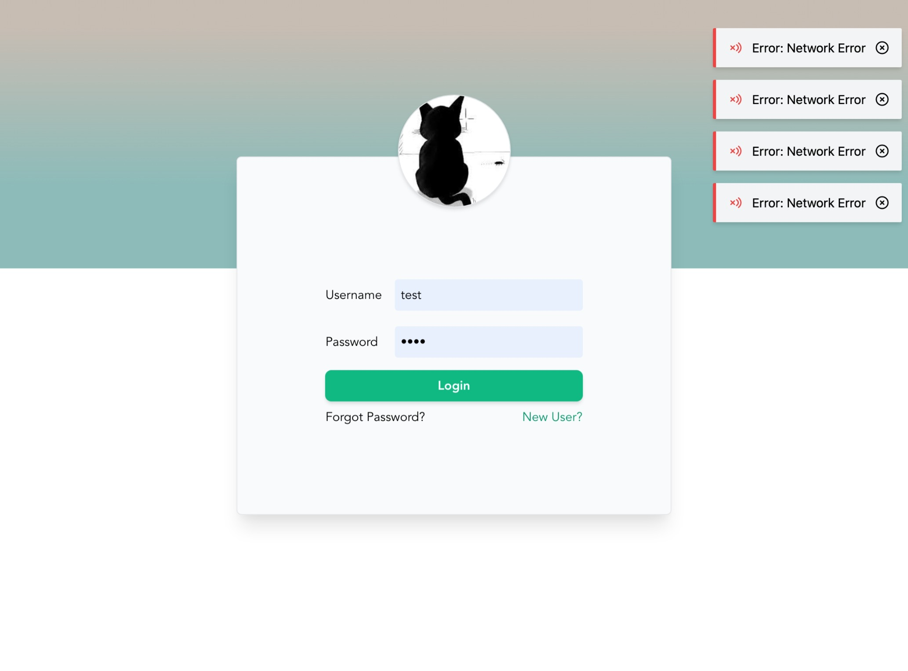
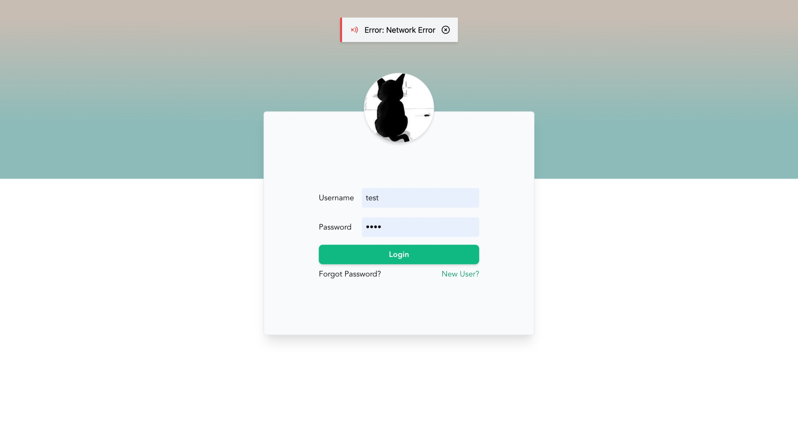

<div align=center>
<h1>
Tail-Mess
</h1>
<h4>
Vue3 环境下并采用Tailwind CSS框架 编写的消息插件
</h4>

<h3>

**⚠️ 暂时没有打包,不可在 npm 上下载使用,不过你可以下载该仓库然后直接使用里面的内容.**

</h3>


</div>

##### 预览

<div align=left>

右上



居中



</div>

#### 主要使用包
1. @icon-park/vue-next (字节的开源图标库)
2. Tailwind CSS (在开发的时候需要安装此环境,假如未安装会出现错误)

### 使用方法

#### 安装

`main.ts`

```typescript
import TailMessage from "@tail-mess";
// 注入全局配置
app.use(TailMessage, { maxCount: 10, showIcon: true } as IMessageConfig);
```

#### 在普通的 Typescript 文件中使用

```typescript
import messageApi from "@tail-mess";
messageApi.error({
    message: "error",
    type: "error",
    anchorOrigin: {
        vertical: "top",
        horizontal: "right",
    },
    closeable: true,
});
```

#### 在 Vue 组件中使用

```typescript
// 直接使用
this.$mess("something info");
// 调用具体方法使用
this.$mess.info("info");
// 使用 IMessageOptions
this.$mess({
    message: error,
    type: "error",
    anchorOrigin: {
        vertical: "top",
        horizontal: "right",
    },
    closeable: true,
});
```
